# RTSD
Этот репозиторий содержит различные скрипты для обучения детектора на базе Tensorflow Object Detection API.
## Цель
Недавно Google выпустил новый Tensorflow Object Detection API для упрощения процедуры обучения детекторов.
Основная идея практики была понять насколько хорошо можно решать задачу детекции автодорожных знаков по средствам использования TOD API и заодно освоить данный "аппарат".
Для обучения бралась база автодорожных знаков - [RTSD](https://yadi.sk/d/TX5k2hkEm9wqZ) 
([статья](http://www.computeroptics.ru/jour/article/view/341)).
## Актуальность самой задачи.
Сама задача детекции автодорожных знаков на изображении является очень актуальной на данный момент. Например, 
сейчас крупнейшие компании активно разрабатывают self-driving car ([Tesla](https://www.tesla.com/autopilot) ,
[Yandex](https://yandex.com/company/blog/yandex-taxi-unveils-self-driving-car-project/)), 
для чего им необходимо уметь по изображениям сцены, полученных с видеорегистратора (камеры),
распознавать дорожные знаки с точностью на равне с человеческой. (для чего нужен очень хороший детектор)
## Разбиение выборки
Поддерживает различные варианты (в скрипте `create_rtsd_tf_record.py`) - 
такие как: Рандомно (8:2), 8:2 (где мы берем первые 80% изображений в порядке 
сортировки по названиям для train, остальные - для test), 7:3 (где основной упор делается на том, чтобы сохранить отношения
по классам, т.е. чтобы в тестовой выборке каждого класса содержалось 2:8 по отношению к трейну). Обучение в основном
производилось на 2 (как у Кости) и 3 варианте разбиения.
### По классам.
Для каждого изображения подсчитывался вектор - 
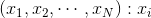 - количество автодорожных знаков класса i на данном изображении. Т.к. хотелось сделать так, 
чтобы в тестовой выборке каждого класса содержалось 2:8 по отношению к трейну, то по сути переформулировав условие - получим:
хотим выбрать такие объекты, чтобы сумма по каждому из столбцу была не более чем
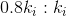 - количество знаков класса i во всей выборке, и 
была максимальной. По сути это есть обычное условие задачи о рюкзаке (где ценность=вес), только вместо одномерных 
объектов мы имеем n-мерные. Т.к. задача NP-полная, а размер датасета довольно большой, то логичнее всего для ее решение 
придумать какой-то жадный алгоритм, нежели чем реализовывать известные методы ее решения (метод ветвей и границ и др.). Сначала
я отсортировал столбцы в порядке возрастания k (т.е. классы с наименьшем количеством элементов теперь вначале, с наибольшем 
в конце), далее отсортировал лексикографически полученную таблицу и проходился подряд по объектам начиная с первого и если он
удовлетворял условию x_i < k, то клал его в рюкзак и k = k - x_i, иначе пропускал. Идея проста - вначале мы берем те предметы,
которые имеют наибольший "удельный" вес, т.е. наиболее важные для нашего разбиения (остальные классы с большим содержанием в
выборке доберутся потом на следующих итерациях). 
Ниже привожу сравнительные показатели распределений классов для разбиения по классам и разбиения 8:2.

 
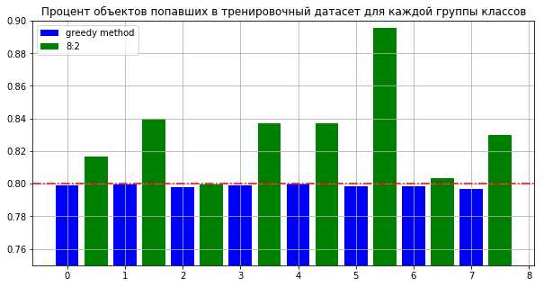

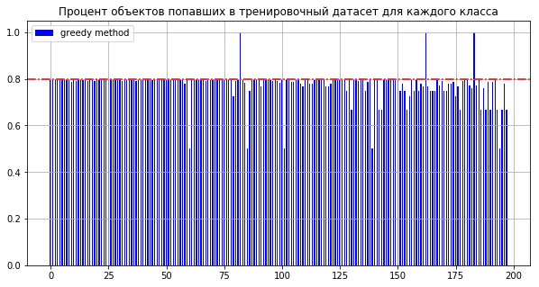 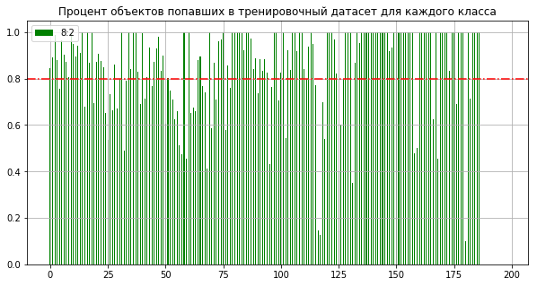 

- Плюсы: Как мы видим с точки зрения того, чтобы сохранять отношения классов для train и test в выборках (чтобы не
случалось такого, что в test-овую часть попали классы знаков из группы знаков, которые лучше находятся детектором), разбиение
по классам лучше чем разбиение "8:2" (т.к. в нем ~ 80 классов знаков попадают почти целиком в train датасет, и на этих классах отношение 9:1) 
+ Минусы: При таком разбиение мы не учитываем того, что в test датасет могут попасть изображения с похожими сценами из train
в отличие от разбиения "8:2", что может негативно отразиться на измерение качество детектора.
### 8:2
Идея этого разбиения в том, чтобы изображения с похожими сценами не попадались в разные датасеты. Мы берем 80% 
первых изображений в порядке сортировки по названиям для train, остальные - для test, т.к. в названии содержатся дата и 
время съемки, то таким способом мы сводим пересечение по сценам к минимуму.
### Рандомно
Просто случайным образом разбивается выборка на train и test в отношении 8:2. Это разбиение почти не использовал, т.к. 
показывало на одном из экспериментов сравнительно лучший результат при измерении ошибок, чем на других разбиениях.
## Аугментация
Вообще Tensorflow object detection api поддерживает различные способы аугментации данных, что довольно удобно, и
конкретно посмотреть какие я использовал можно в `configs/model.config`. В основном это было отражение по горизонтали и
сжатие/растяжение.
## Обучение различных детекторов
### [SSD](https://arxiv.org/pdf/1512.02325.pdf)
С SSD возникли определенные трудности, т.к. долго не мог получить "достойный" результат на маленьких объектах, что в принципе
указано и в самой статье. AUC варьировался от 0.55-0.65. Значительно улучшить результат помогло увеличение входного инпута
с 300x300 до 1280x620, random crop zoom out (сжимаем картинку в несколько раз и рандомно располагаем на полотне текущего 
размера и заполнением как-то оставшееся пространство) и базовая архитектура - inception_v2. Остальные параметры обучения
можно найти в `configs/ssd.config`.

 
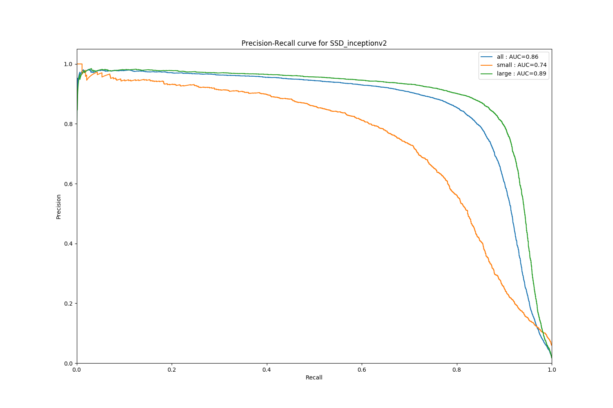

Время предикта на K40 были немного лучше чем у Faster-RCNN.

### [R-FCN](https://arxiv.org/pdf/1605.06409.pdf)
Лучший результат был получен при использовании в качестве базовой архитектуры ResNet-101. Основные параметры обучения можно
найти в `configs/r-fcn.config`.

 
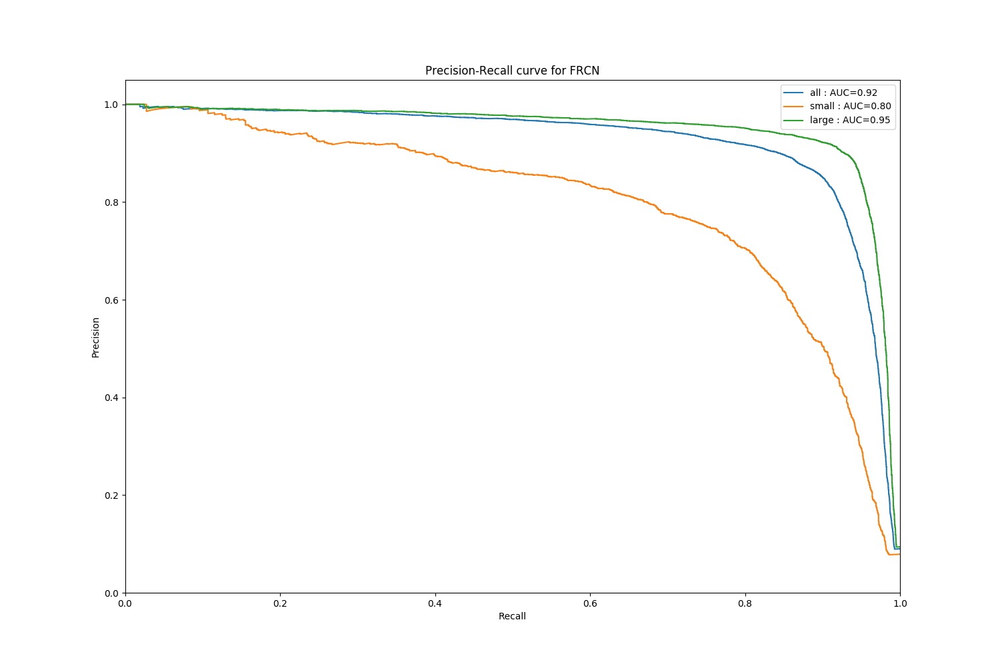

### [Faster-RCNN](https://arxiv.org/pdf/1506.01497.pdf)
Faser-RCNN показал наилучшей результат на тестовой выборке, поэтому я также обучил этот детектор при разбиение "8:2".
Основные параметры обучения можно найти в `configs/faster-rcnn.config`.

 
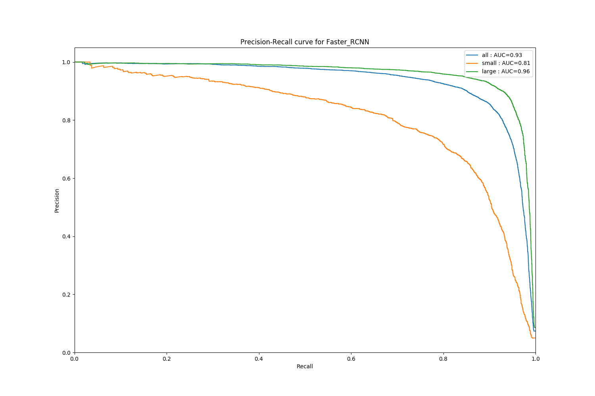
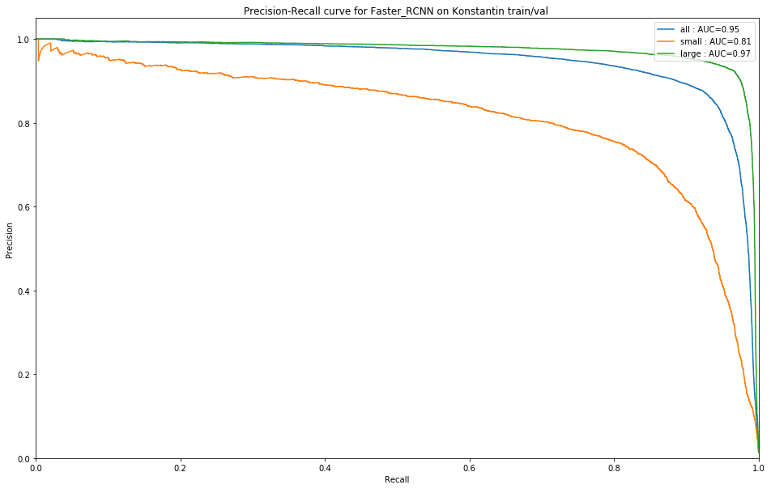
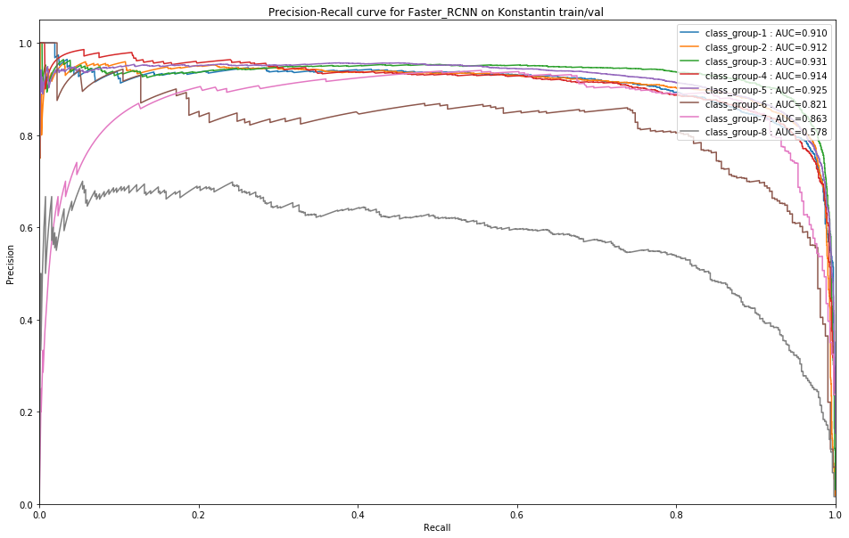

Как мы видим особые трудности вызывает class_8, его тяжелее всего детектить. Я посмотрел некоторые примеры в test выборки на
которых детектор ошибался и заметил, что довольно часто детектор видит какие-то маленькие знаки, которые не попали в 
разметку. Вот пример:

 
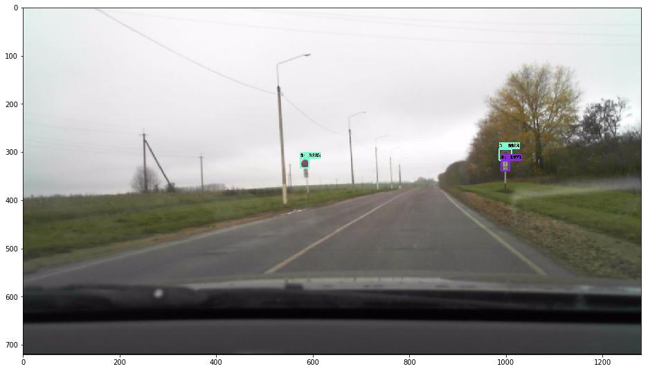

## Вывод

### Результат
До результатов написанной под эту задачу сети детекторы не дотягивают (AUC Кости ~ 0.98), однако потенциально можно
попробовать улучшить результат: более хитро подбирать картинки в batch, попробовать 
[DSSD](https://arxiv.org/pdf/1701.06659.pdf), попробовать поиграться с различной аугментацией и т.д. 

### Tensorflow OD API
Довольно удобный инструмент, чем-то напоминающий Caffe своими prototxt и config, однако видно, что он еще не доработан -
много глючных моментов: иногда при обучении подтекает память, 
не очень гибкий (если нужно что-то свое, то приходиться копаться и менять код внутри API) и т.д.
